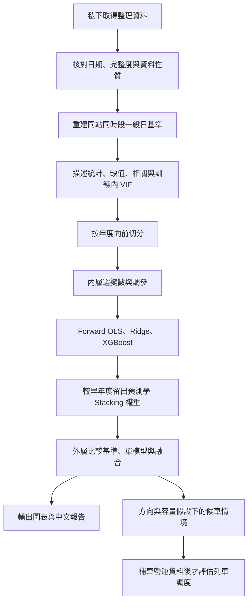

# 大稻埕煙火人流分析與捷運班次模擬

## 專案目的與目前進度

整理北捷逐時 OD、活動、天氣及社群資料，分析煙火活動人流，並銜接候車與列車容量情境。已完成資料前處理、Threads／PTT 文字雲、網站，以及本次 **第一版變數分析、預測比較與假設排隊試算**。

**先看 [分析結果](result/analysis_v1/report.md)，實作細節看 [process.md](process.md)。** 圖片都在根目錄的 [`result/analysis_v1/figures/`](result/analysis_v1/figures/)，點開報告即可一起查看；舊有文字雲仍在 `results/`。

| 項目 | 本版規格 |
|---|---|
| 目標 | 預測活動日四站 18–23 時的來源進站人次 |
| 範圍 | 北門、大橋頭站、雙連、民權西路；2017–2026 年 21 場活動、504 列 |
| 模型 | Forward OLS、Ridge、XGBoost、等權平均、MAE Stacking；一般日基準作比較 |
| 評估 | 2024、2025、2026 年共 9 場；訓練、選變數與學權重只用更早年度 |
| 可用輸入 | 同站同時段一般日基準、站別、小時；候選為週末、年內日序、年度序號 |
| 暫不進模型 | 事後實測天氣、無人機實況、實際節目長度、年度經費、活動後聲量 |
| 適用界線 | 回顧式向前驗證；尚未核實歷史資料發布時間，不能稱已驗證真實 D−1 部署 |

504 列不等於 504 場獨立活動。VIF、缺值與活動層次相關均已檢查；VIF 不作自動刪欄門檻，沒有對逐列資料套獨立樣本的 p 值。

## 第一版實際結果

以下為共同 9 場外層測試，MAE／RMSE 單位為人次／站／小時，越小越好。

| 方法 | MAE | RMSE |
|---|---:|---:|
| 等權平均 | **611.72** | 1,222.62 |
| MAE Stacking | 633.75 | 1,171.31 |
| XGBoost | 646.30 | 1,264.98 |
| Forward OLS | 680.60 | **1,152.28** |
| Ridge | 691.34 | 1,372.60 |
| 一般日基準 | 871.48 | 1,791.08 |

等權平均的 MAE 比基準降低約 **29.8%**；OLS 的 RMSE 與本次尖峰低估指標較低。學習混合權重沒有勝過簡單平均；各年度、活動與車站的表現仍須一起看。


**北門大型尖峰仍明顯低估，現在不能直接用來決定營運班表。** 排隊部分使用明示的方向比例、步行時間、分鐘到達及剩餘容量，比較不同班距；尚未取得車隊、折返、班表與站台容量限制，未宣稱完成真實調度最佳化。歷史資料曾做探索，這次也不是完全未接觸資料的確認性實驗。

## 分析流程



## 快速開始

在專案根目錄執行：

```powershell
# 分析環境
uv sync --group analysis

# 先確認資料；不需要連 MySQL，不會寫回 SQL
uv run --group analysis python -X utf8 src/run_analysis.py --validate-only

# 實際訓練、比較、產圖與報告
uv run --group analysis python -X utf8 src/run_analysis.py

# 有意義的資料、時間切分、融合與排隊測試
uv run --group analysis python -X utf8 -m unittest discover -s tests -p 'test_analysis_v1*.py'
```

重跑需要隊員私下提供三個整理檔，依相同相對路徑放置：

- `data/processed/event_station_hourly_context.csv`
- `data/processed/calendar_baseline/candidate_audit.csv`
- `data/processed/station_hourly.parquet`

可選的 `.local/research_review/2026-10-07-refresh/statistics_snapshot.json` 只補實際節目 EDA；缺少它仍可跑同一套預測，但節目完整度圖不同。各檔 SHA-256 與套件版本記錄在 [run_manifest.json](result/analysis_v1/run_manifest.json)。SQL、原始資料與逐筆預測不隨本版提交；只看報告與 PNG 不需要資料庫或上述檔案。

`--require-d1` 會在事前資訊可用性尚未核實時停止，避免把回顧結果誤稱為真實事前預測。參數可在 [`configs/analysis_v1.json`](configs/analysis_v1.json) 設定，詳細公式及變數資格見 [process.md](process.md)。

<details>
<summary>既有網站、前處理與文字雲操作</summary>

```powershell
uv sync --group analysis --group notebook --extra social --extra web --extra app
.\app\start.ps1
.\.venv\Scripts\python.exe -X utf8 src/main.py --reuse-clean --mysql
.\.venv\Scripts\python.exe -X utf8 src/import_weather.py
.\.venv\Scripts\python.exe -X utf8 src/threads_web_collect.py
.\.venv\Scripts\python.exe -X utf8 src/ptt_web_collect.py
```

捷運月 CSV 放在 `data/original_data/`；前處理仍需本機 MySQL 的活動與聲量資料。網站透過 Tailscale 私人連線。Threads 預設在新開 Edge 登入後操作，PTT 不需登入；文字雲是公開搜尋樣本，不是全站聲量。年度活動預算與宣導所需費用應各存年度一筆，不能展開後當成每場獨立經費；本版未將它們放進預測。

</details>

## 專案結構

```text
統計實務/
│
├── README.md                         # 專案介紹、實際結果與文獻
├── process.md                        # 資料資格、實作公式、驗證與限制
├── pyproject.toml                    # uv 環境；analysis 套件群組
├── uv.lock                           # 鎖定套件版本
├── configs/analysis_v1.json           # 時間切分、模型與排隊情境設定
│
├── src/
│   ├── run_analysis.py               # 本版分析入口
│   ├── analysis_v1/
│   │   ├── data.py                   # 資料核對與逐時基準
│   │   ├── eda.py                    # 缺值、描述統計與活動層次相關
│   │   ├── models.py                 # 三模型、向前驗證、融合與 VIF
│   │   ├── queueing.py               # 平行服務 M/M/c 與列車批次隊列
│   │   ├── queue_report.py           # 方向與班距假設的情境圖表
│   │   └── reporting.py              # 模型圖表及中文結果報告
│   ├── main.py                       # 既有捷運前處理
│   └── ...                           # 氣象、社群與資料匯入程式
│
├── result/analysis_v1/
│   ├── report.md                     # 已執行的結果與解讀
│   ├── figures/                      # 10 張分析 PNG
│   ├── tables/                       # 指標、VIF、相關與情境 CSV
│   ├── folds.json                    # 各外層模型與權重
│   └── run_manifest.json             # 資料雜湊、環境與設定
│
├── app/                              # 前端、FastAPI、Tailscale 啟動
├── data/                             # 原始與整理資料，另外私下共享
├── .local/analysis_v1/                # 私有逐筆預測與研究模型，不提交
├── tests/                            # 資料、時間隔離、融合及排隊測試
├── docs/                             # 既有說明、資料規格與文獻
├── mysql/                            # 匯入程式；SQL 留在本機
└── results/                          # 舊有前處理、社群與研究結果
```

## 詳細說明與參考資料

- [第一版完整分析結果](result/analysis_v1/report.md)／[實作細節與公式](process.md)
- [網站啟動與隊員連線](app/README.md)
- [資料前處理與欄位定義](docs/data_preprocessing.md)／[資料庫結構](docs/database_schema.dbml)
- [Threads](docs/threads_collection.md)／[PTT](docs/ptt_collection.md)／[Google Trends](mysql/GOOGLE_TRENDS_README.md)
- [既有參考論文](docs/references.md)／[研究規劃](docs/research_plan.md)

本版方法依據：

| 文獻 | 本版用途與界線 |
|---|---|
| [Heinze、Wallisch & Dunkler（2018）](https://onlinelibrary.wiley.com/doi/full/10.1002/bimj.201700067)，§2.2、2.4 | 變數選擇及選後推論風險；Forward Selection 不保證最佳。本版用內層時間 MAE，不做選後普通 p 值。 |
| [Hoerl & Kennard（1970）](https://doi.org/10.1080/00401706.1970.10488634)，§0–2 | Ridge 在相關設計下的偏差與變異取捨；不能推論本資料一定勝 OLS。 |
| [Chen & Guestrin（2016）](https://arxiv.org/abs/1603.02754)，§2 | XGBoost 正則化加法樹；本版的淺樹、小 grid 是研究設定，不是原文保證的最優參數。 |
| [Breiman（1996）Stacked Regressions](https://statistics.berkeley.edu/sites/default/files/tech-reports/367.pdf)，§1、2、5、7 | 用留出預測學融合權重；本版活動平衡 MAE 線性規劃與年度向前切分為延伸，原文主要用非負最小平方。 |
| [Varma & Simon（2006）](https://pmc.ncbi.nlm.nih.gov/articles/PMC1397873/) | 分開內層選模與外層評分，避免共用驗證資料造成樂觀偏差；不能解決活動場次少或發布時間未知。 |
| [Hyndman & Athanasopoulos，§5.10](https://otexts.com/fpp3/tscv.html) | 訓練只用預測時點以前的資料；本版再按整年度及活動分組。 |
| [Santanam 等（2021），Public Transit for Special Events: Ridership Prediction and Train Optimization](https://arxiv.org/abs/2106.05359) | 活動需求預測銜接列車排程的研究方向；本版只完成批次容量情境，未重現其調度最佳化。 |

資料來源：

- [北捷分時進出站運量](https://data.taipei/dataset/detail?id=63f31c7e-7fc3-418b-bd82-b95158755b4d)
- [固定／變動成本](https://www.metro.taipei/cp.aspx?n=20CB8DE3F41B411)：參考 114 年審定決算書。
- [變動／固定公里數](https://whhr.gov.taipei/News_Content.aspx?n=0121E4C78246FC0D&s=3E147DD6A74BE990)
- [天氣資料](https://codis.cwa.gov.tw/StationData)：氣象署 CODiS。
- [特殊節假日](https://data.gov.tw/dataset/14718)：政府行政機關辦公日曆表。
- [大稻埕煙火排程參考](https://data.gov.tw/dataset/7778)：觀光資訊活動資料庫。
