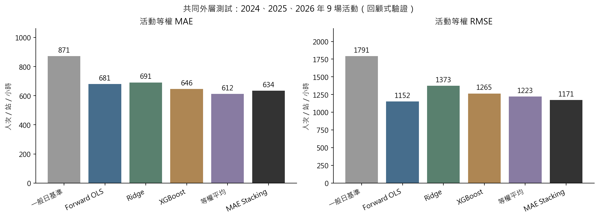
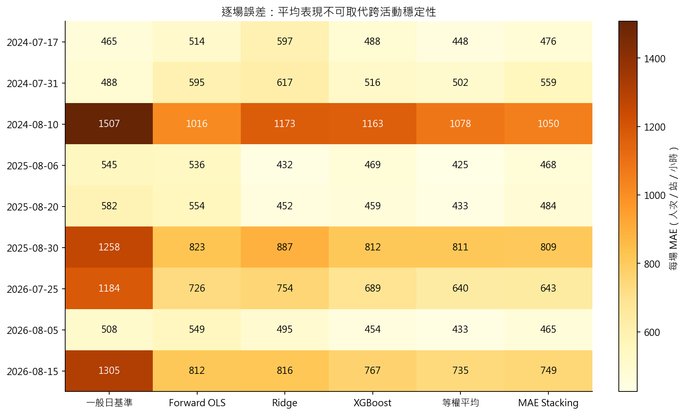
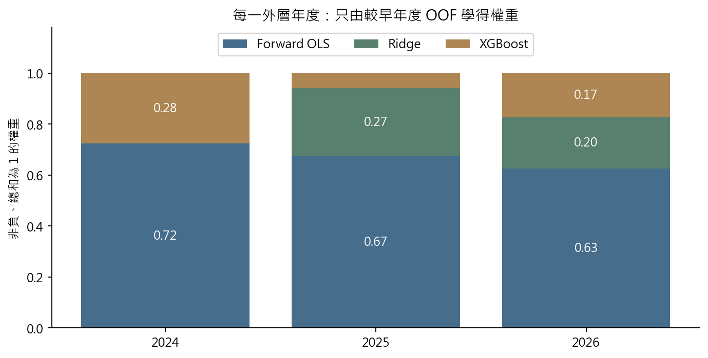
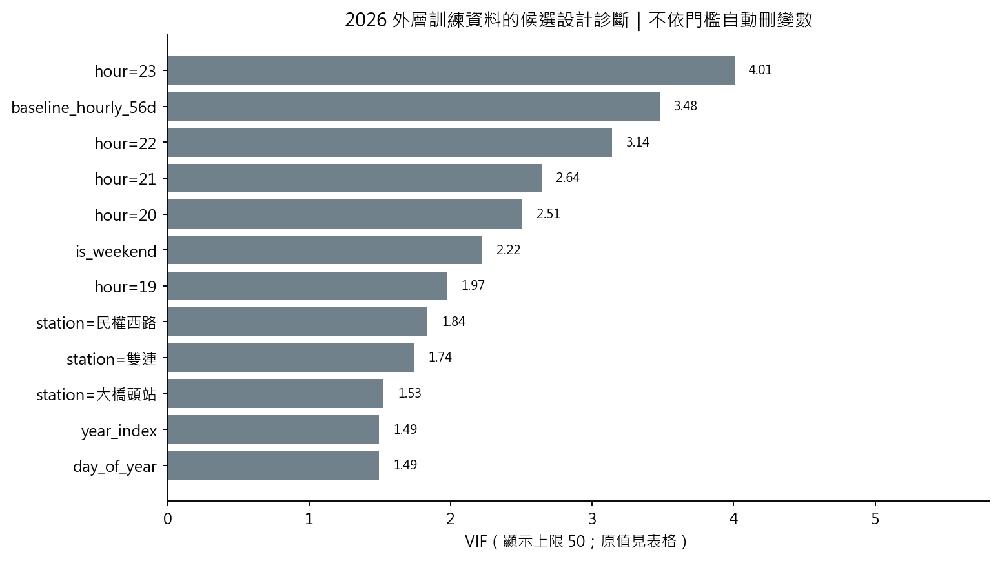
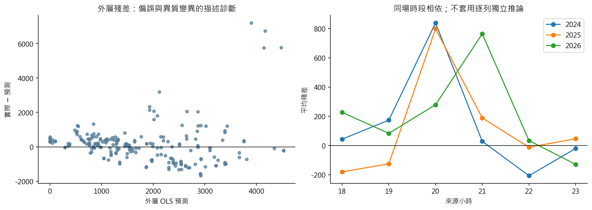
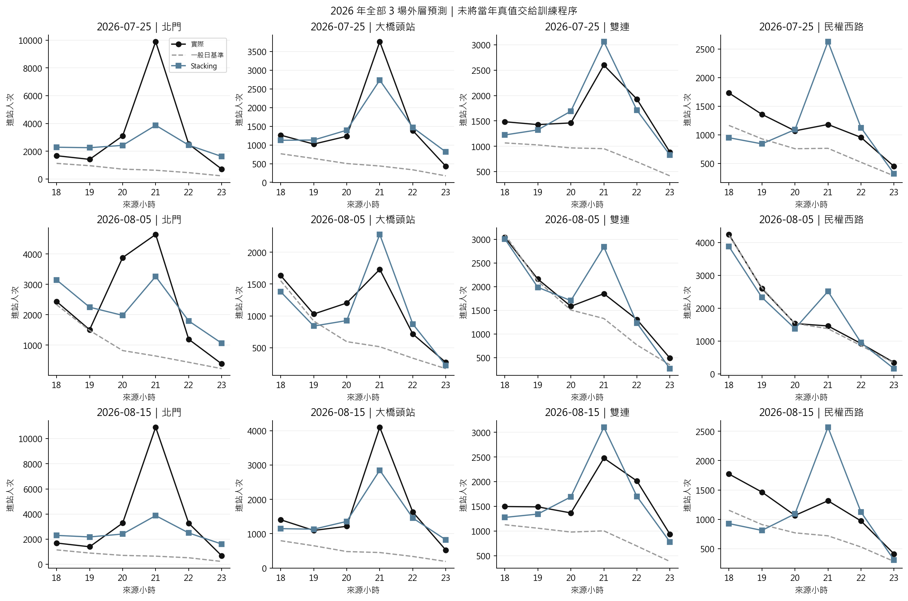
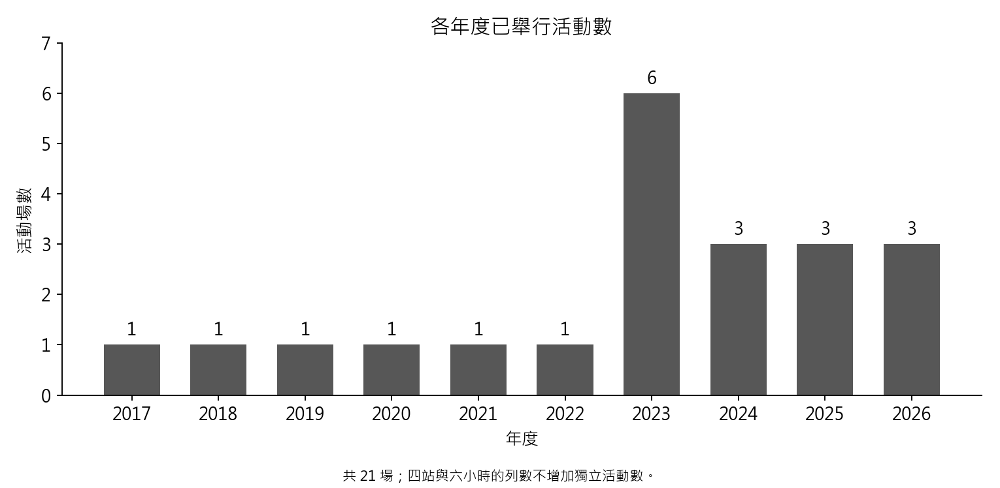
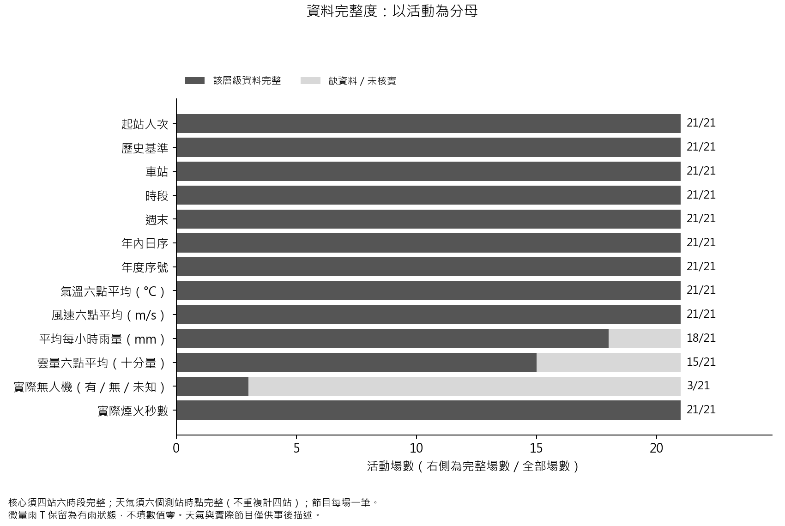
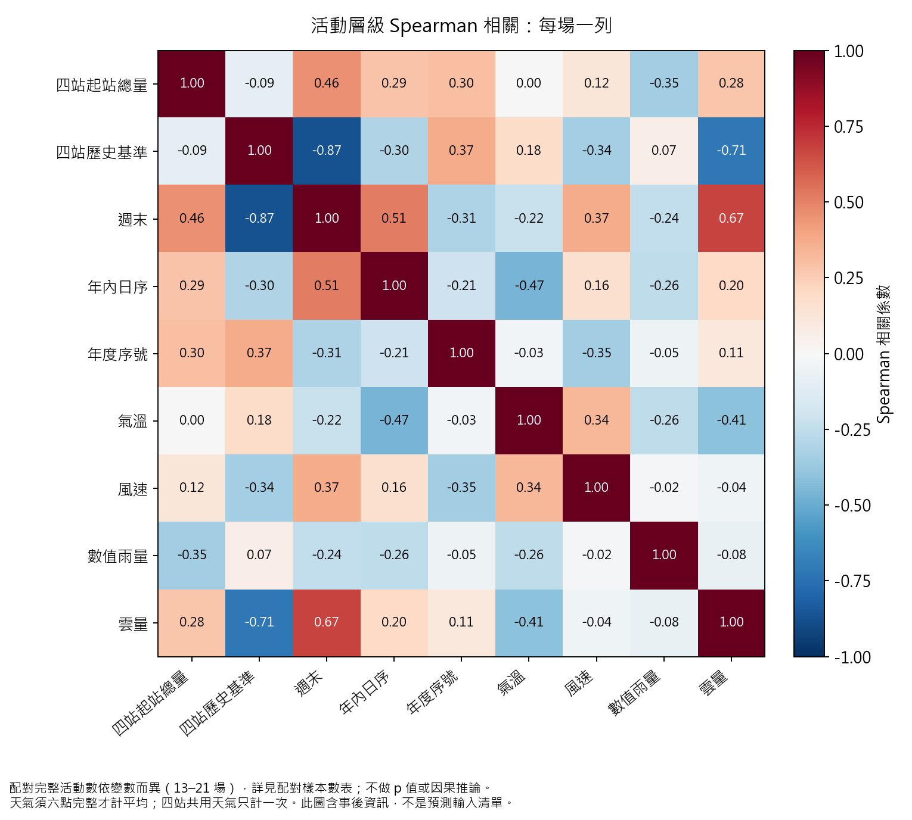
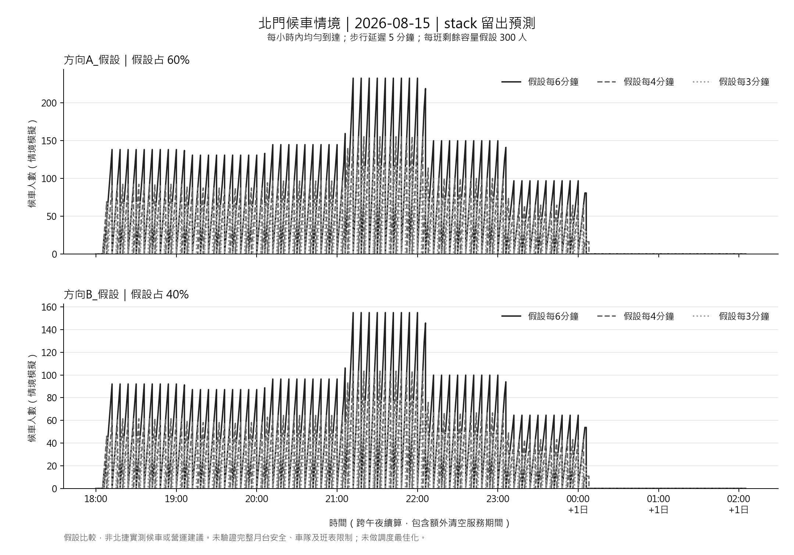

# 第一版人流預測分析結果

本次已實際執行資料核對、變數描述、Forward OLS、Ridge、XGBoost、等權平均與 MAE Stacking，並完成列車批次容量的假設情境試算。

## 1. 結論與適用範圍

- 資料為 2017–2026 年 **21 場**已舉辦活動、四站、18–23 時，合計 **504 列**。展開後的列數不是獨立活動數。
- 原始候選共 26 個日期；取消／延期未納入。因此分析是條件於活動已舉辦的人流比較，未建立活動取消機率模型。
- 共同比較為 **2024、2025、2026 年 9 場、216 列**；每年僅使用更早年度訓練，選變數與混合權重都在訓練資料內完成。
- 本次平均 MAE 最低為 **等權平均：611.72 人次／站／小時**，一般日基準為 871.48，相較降低 29.8%。這是本次歷史評估結果，不能保證未來活動也最佳。
- RMSE 最低為 **Forward OLS：1152.28**；實際尖峰時低估指標最低為 **Forward OLS：1190.25 人次**。平均準確度與尖峰風險應分開評估。
- **目前屬回顧式向前驗證，尚未核實真實 D−1 可用性。**歷史 OD 發布時間與日曆版本仍缺證據；事後天氣、無人機實況及實際節目長度沒有放入預測。
- 測試僅 3 個年度，不以展開後的列數作獨立樣本進行模型優劣顯著性檢定，也不提供過度精確的信賴區間。
- 這些歷史年份先前已做探索，本次是目前流程的歷史模型比較，並非完全未接觸資料的確認性測試。

## 2. 模型比較

| 方法 | MAE | RMSE | 實際尖峰時平均低估人次 | 尖峰時刻 MAE（小時） |
|---|---|---|---|---|
| 等權平均 | 611.72 | 1222.62 | 1469.51 | 0.64 |
| MAE Stacking | 633.75 | 1171.31 | 1299.66 | 0.81 |
| XGBoost | 646.30 | 1264.98 | 1548.18 | 0.81 |
| Forward OLS | 680.60 | 1152.28 | 1190.25 | 0.81 |
| Ridge | 691.34 | 1372.60 | 1722.28 | 0.94 |
| 一般日基準 | 871.48 | 1791.08 | 2379.03 | 1.61 |

MAE／RMSE 先按活動平均；目前每場同為 24 列。尖峰低估先找每場每站實際最高時段，再計正向低估；尖峰時刻誤差以預測最大值時段與實際最大值時段比較，同值取較早時段。低 MAE 不等於尖峰風險最低。

完整逐年、逐場結果見 [年度指標](tables/yearly_metrics.csv) 與 [每場指標](tables/event_metrics.csv)。較早年份訓練場次更少，2023 活動型態及平假日改變也會影響跨年泛化。

## 3. 變數、選模與權重

固定核心為同站同時段一般日基準、站別及小時；候選為週末、年內日序與年度趨勢。OLS 用內層時間 MAE 做 Forward Selection，Ridge／XGBoost 使用全部合格候選。連續欄位標準化只使用當次訓練資料；VIF 是設計診斷，不作機械式刪欄門檻。年度與日序可能代表活動型態差異，不是因果效果。

| 測試年 | 訓練活動 | 測試活動 | OLS額外選入 | Ridge λ | OLS權重 | Ridge權重 | XGB權重 |
|---|---|---|---|---|---|---|---|
| 2024 | 12 | 3 | 無 | 1.00 | 0.72 | 0.00 | 0.28 |
| 2025 | 15 | 3 | is_weekend | 0.10 | 0.67 | 0.27 | 0.06 |
| 2026 | 18 | 3 | is_weekend | 0.10 | 0.63 | 0.20 | 0.17 |

三個基礎模型的較早年度 OOF 預測經非負且總和為 1 的 MAE 線性規劃求權重；測試真值不參與求解。MAE 最佳化僅保證不劣於可行單模型的**同一份中層訓練損失**，不保證外層或未來誤差較小。

## 4. 2026 年全部外層預測

圖顯示該年全部活動與四站，未只挑表現較好的案例。北門大型尖峰仍明顯低估，鄰站亦可能高估，不能只用整體 MAE 決定調度。各站數值見 [車站指標](tables/station_metrics.csv)。逐筆來源與模型物件留在本機 `.local/analysis_v1/`，Git 提供彙整圖表。

## 5. 資料探索

探索圖由 `eda.py` 產生；活動層次關聯係數只描述這些場次之間的共變，實測天氣僅供事後探索。缺測、微量雨與無人機未知狀態都不能直接補成零。相關係數配對樣本數與描述統計見 [tables](tables/)，輸入資格見 [變數使用表](tables/feature_eligibility.csv)。

## 6. 如何銜接排隊與列車調度

- 使用設定指定的 2026-08-15 北門 外層 stack 預測；方向比例假設為 方向A_假設 60%／方向B_假設 40%、逐分鐘均勻到達、步行 5 分鐘。每班剩餘容量與班距詳見情境表，不是查得的北捷營運值。
- 計算累積等待人分鐘、最大隊列、殘留人數與完整清空時的平均等待。若未清空，不冒充完整平均等待。
- **這是條件式容量情境，不是已估計的真實候車或最佳列車時刻表。**來源小時計數的物理到站意義、方向、分鐘尖峰與列車可用容量仍待核實。
- M/M/c 函式另供平行服務櫃台使用；列車用批次登車服務模型。尚未取得車隊、折返、軌道最小班距、班表與站台容量限制，不宣稱完成調度最佳化。

情境數字見 [排隊比較表](tables/queue_scenarios.csv)。補齊營運條件後，再以等待人分鐘及營運成本為目標，加上班距、車隊、折返及安全容量限制求解。

本例各情境均未因容量不足而滯留，平均等待恰為班距的一半。這是均勻分鐘到達、足夠剩餘容量與本例時段配置造成的結果，不能證明實際煙火散場尖峰沒有壅塞。

## 7. 重現與文獻

- [專案入口與主要文獻](../../README.md)
- [完整實作方法、公式、資料條件](../../process.md)
- [資料與程式 SHA-256、環境與參數](run_manifest.json)
- [年度模型設定](folds.json)、[內層選模紀錄](tables/inner_selection.csv)、[時間切分](tables/temporal_folds.csv)

圖表與指標由程式生成，沒有以預設數字代替分析；排隊情境中的容量與方向比例則明確屬人為假設。
